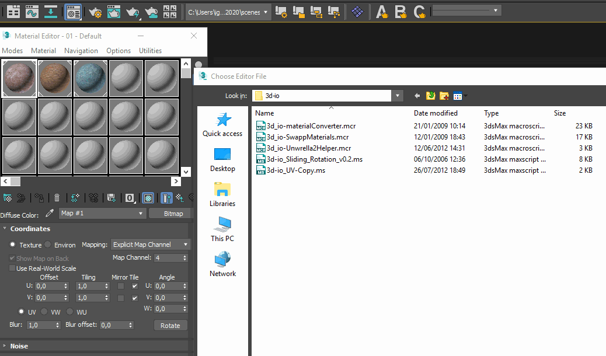

# UV-Copy-MaxScript
Swap easily UV Channels in 3ds Max with this MaxScript

Installation
Unzip the contents of this zip file into the [maxfolder/sripts] directory, for example: c:\3dsmax2017\scripts\.
After you extract the files you can add the script to your interface. It is located in:
Customize ->
	Toolbars  ->
		Group: Main UI
		       Category: -> 	--3d-io--

System Requirements
A system with 3ds Max installed.
We have only tested this script on max 2020 -> 2023 but it should work with older versions.

Using this script
This script adds a single button to your Interface. When you open it you can:

+ Select the object with multiple UV Channels
+ Select the channel you want to be copied and press copy

